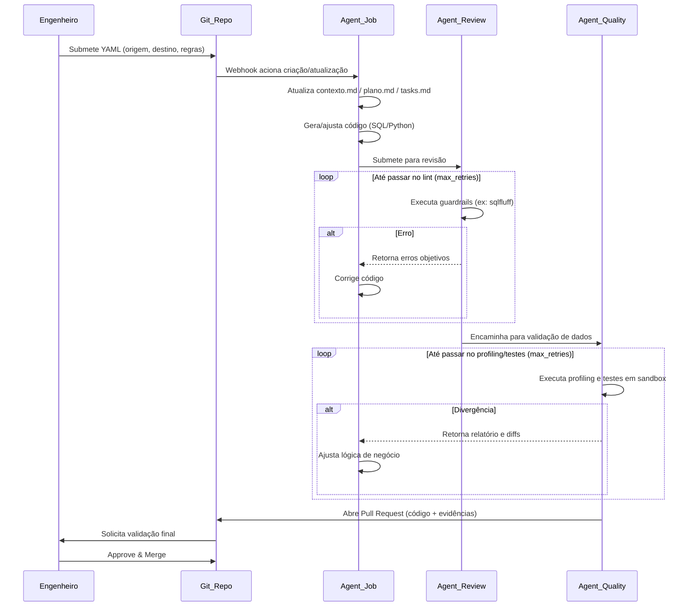

# Framework de Engenharia de Dados Orientada a Agentes (ADE)
## Documento de Arquitetura e “Constituição” do Sistema

> **Propósito**: definir diretrizes, arquitetura e padrões operacionais de um **Multi‑Agent System (MAS)** aplicado à Engenharia de Dados, com **geração/recuperação assistida por LLMs** e **execução determinística** ancorada em orquestradores tradicionais e guardrails.

---

## Sumário
1. [Visão Geral](#1-visão-geral)
2. [Escopo e Não‑Escopo](#2-escopo-e-não-escopo)
3. [Glossário e Conceitos‑Chave](#3-glossário-e-conceitos-chave-rastreabilidade-de-mercado)
4. [Topologia do Sistema](#4-topologia-do-sistema)
5. [Agentes e Responsabilidades](#5-agentes-e-responsabilidades)
6. [Fluxos de Operação (Diagramas)](#6-fluxos-de-operação-diagramas)
7. [Constituição do Sistema (Prompts, Estado e Regras)](#7-a-constituição-do-sistema-prompts-estado-e-regras)
8. [Guardrails, Segurança e Governança](#8-guardrails-segurança-e-governança)
9. [Observabilidade e SLOs](#9-observabilidade-e-slos)

---

## 1. Visão Geral
Este framework realiza a transição de pipelines puramente imperativos para **pipelines declarativos e orientados a intenção**. A IA atua como força de trabalho para:

- **Criar** e **evoluir** pipelines (código SQL/Python e configuração),
- **Revisar** (lint, performance estática, padrões),
- **Validar qualidade e fidelidade dos dados** (profiling/testes),
- **Apoiar self-healing** (propor correções com base em logs e runbooks),

enquanto a **execução rotineira** permanece sob um **orquestrador determinístico** (Airflow/Dagster etc.) e sob **Guardiões Determinísticos** (linters, testes, políticas de CI/CD).

---

## 2. Escopo e Não‑Escopo
### Escopo
- Criação/refatoração de pipelines a partir de especificações declarativas (ex.: YAML).
- Revisão automática de código via ferramentas determinísticas.
- Validação em sandbox e abertura de PR com evidências (ex.: relatórios).
- Self-healing baseado em catálogo de erros (runbook) + limites (circuit breaker).

### Não‑Escopo (por padrão)
- Execução “autônoma” em produção sem PR/approval humano (a menos que explicitamente habilitado).
- Acesso direto de agentes a segredos de produção fora do padrão do orquestrador/CI.
- Mudanças em dados de produção sem trilha auditável (PR + logs + artefatos).

---

## 3. Glossário e Conceitos‑Chave (Rastreabilidade de Mercado)
Para alinhamento com iniciativas de mercado e literatura de LLM Ops:

- **ADE (Agentic Data Engineering)**: paradigma em que agentes autônomos gerenciam o ciclo de vida de dados (ingestão, transformação, modelagem) guiados por **metadados** e **intenções declarativas** (ex.: YAML), em vez de scripts manuais.
- **MAS (Multi‑Agent System)**: múltiplos agentes interagindo sob o princípio de **Segregation of Duties** (criação ≠ revisão ≠ qualidade).
- **Tiered LLM Architecture (Arquitetura em camadas)**: uso de **modelos de fronteira** para raciocínio/geração (ex.: GPT‑4‑class, Claude‑class) e **SLMs locais** (ex.: Llama‑class via Ollama) para roteamento/triagem e monitoramento.
- **Deterministic Guardrails (Guardiões Determinísticos)**: ferramentas objetivas (ex.: `sqlfluff`, testes de qualidade, validadores de schema, profilers) que atuam como **juízes finais** do output. A IA itera até satisfazer essas ferramentas.
- **Documentation‑as‑Code (DaC) para Estado**: agentes são stateless; o estado operacional fica em arquivos versionados (Markdown/YAML) para auditabilidade.
- **Circuit Breaker**: mecanismo de confiabilidade para interromper loops (limite de iterações, orçamento de tempo, custo/tokens).

---

## 4. Topologia do Sistema
A arquitetura integra componentes clássicos de engenharia de dados com o ecossistema de agentes.

### 4.1. Camada de Integração e Execução
- **Fontes de Dados (N)**: APIs, bancos relacionais, IoT, mensageria, arquivos, etc.
- **Data Lake / Data Warehouse**: destino final de armazenamento/compute.
- **Orquestrador (“Motor”)**: Airflow/Dagster (ou equivalente).  
  - Executa DAGs/tarefas determinísticas.
  - Emite logs e eventos (webhooks) para monitoramento.
  - **Não toma decisões de design**; apenas executa e reporta.
- **CI/CD**: pipeline de validação (lint, testes, profiling, policy checks).
- **Repositório Git (“Memória de Longo Prazo”)**:
  - Especificações (`.yaml`)
  - Regras/Config de guardrails
  - Estado do agente (`contexto.md`, `plano.md`, `tasks.md`)
  - Artefatos finais (SQL/Python)
  - Evidências (ex.: `Profiling_Report.md`)

---

## 5. Agentes e Responsabilidades
> Regra: **um agente propõe, outro valida**. O agente de criação não “julga” seu próprio trabalho.

| Agente | Papel | Modelo sugerido | Entradas | Saídas |
|---|---|---|---|---|
| **Agent Monitor** | Roteamento/triagem; classifica falhas; aciona fluxos | SLM local | logs, eventos, runbook | tarefa para Agent‑Job; atualização de `tasks.md` |
| **Agent‑Job** | Constrói/ajusta pipeline | Frontier model | YAML, schemas, contexto atual | código SQL/Python; atualização de `contexto.md`, `plano.md`, `tasks.md` |
| **Agent‑Review** | Revisor determinístico de sintaxe/padrões/perf estática | Pode ser LLM + ferramentas | PR branch; regras de lint | feedback objetivo (erros); aprovação p/ qualidade |
| **Agent‑Quality** | Valida fidelidade/qualidade em sandbox | LLM + ferramentas de dados | datasets sandbox; regras DQ | relatório; aprovação/reprovação; gatilhos de retry |

Observação: “Agent‑Review” e “Agent‑Quality” devem tratar **ferramentas determinísticas** como fonte primária de verdade; LLM serve para interpretar mensagens e propor correções.

---

## 6. Fluxos de Operação (Diagramas)

### 6.1. Fluxo de Desenvolvimento e Deploy (CI/CD guiado por IA)
Este fluxo ocorre na criação de um pipeline novo ou refatoração de um existente.



### 6.2. Fluxo de Resiliência (Self‑Healing + Circuit Breaker)
Ativado quando o orquestrador falha em produção.

```mermaid
graph TD
    A[Falha no Orquestrador] --> B[Log/Evento de erro]
    B --> C{Agent Monitor analisa erro}

    C -->|Erro catalogado (Runbook)| D[Despacha para Agent-Job propor correção]
    D --> E{Review + Quality}
    E -->|Passou| F[Abre PR para correção e retomada]
    E -->|Falhou repetidamente| G[Dispara Circuit Breaker (max_retries)]

    C -->|Erro desconhecido/anomalia| H[Dispara Circuit Breaker (timeout/SLA)]

    G --> I[Atualiza tasks.md com STATUS: CIRCUIT_BREAKER_TRIGGERED]
    H --> I
    I --> J[Notifica analista (PagerDuty/Slack)]
    J --> K((Intervenção humana - HUMAN_OVERRIDE))
    K --> L[Commit em tasks.md]
    L --> M[Webhook acorda o fluxo para retomar]
```

---

## 7. A Constituição do Sistema (Prompts, Estado e Regras)
Todos os agentes de criação (Job/Review/Quality) operam sob um system prompt base que impõe:

### 7.1. Princípio: “Padrão Amnésia”
- Agentes **não possuem memória de longo prazo**.
- Todo o estado/progresso/contexto deve residir na branch atual em:
  - `contexto.md` — interpretação do problema e metadados lidos
  - `plano.md` — estratégia passo a passo (Plan‑and‑Solve)
  - `tasks.md` — checklist operacional e estado

### 7.2. Subserviência aos Guardiões
- O agente **não contesta** `sqlfluff`, testes de dados, validações de schema, políticas de CI.
- Se falhar, **corrige e reexecuta** até:
  - passar, ou
  - acionar circuit breaker.

### 7.3. Sintaxe de Gerenciamento de Estado (obrigatória em `tasks.md`)
Os agentes devem utilizar e respeitar:

- `[STATUS: PENDING | RUNNING | DONE]` — progresso de cada tarefa
- `[STATUS: CIRCUIT_BREAKER_TRIGGERED]` — limite atingido; agente deve **parar imediatamente**
- `[HUMAN_OVERRIDE: INITIATED] ... [HUMAN_OVERRIDE: END]` — bloco exclusivo humano

### 7.4. Regra Suprema de Retomada
Se ao inicializar o agente encontrar `[HUMAN_OVERRIDE: INITIATED]` em `tasks.md`, deve:
1. Interromper qualquer raciocínio prévio sobre a tarefa.
2. Assumir instruções do bloco como diretrizes absolutas.
3. Retomar execução exatamente do ponto indicado pelo humano.

---

## 8. Guardrails, Segurança e Governança
Mínimos recomendados:
- **Branch protection**: exigir CI verde e aprovação humana para merge.
- **Permissões**: agentes criam branches/PRs, mas não fazem merge em `main` sem policy.
- **Segredos**: acesso via secret manager do CI/orquestrador; nunca armazenar segredos em Markdown/YAML.
- **Sandbox obrigatório**: Agent‑Quality valida em ambiente isolado com dados mascarados quando aplicável.
- **Trilha de auditoria**: PR + artifacts + logs centralizados.

---

## 9. Observabilidade e SLOs
Registrar e monitorar:
- contagem de retries por etapa (review/quality),
- tempo total até PR (latência),
- taxa de falhas por categoria de runbook,
- custos (tokens, tempo de execução, recursos),
- SLAs de self-healing (tempo até abrir PR / tempo até intervenção humana).