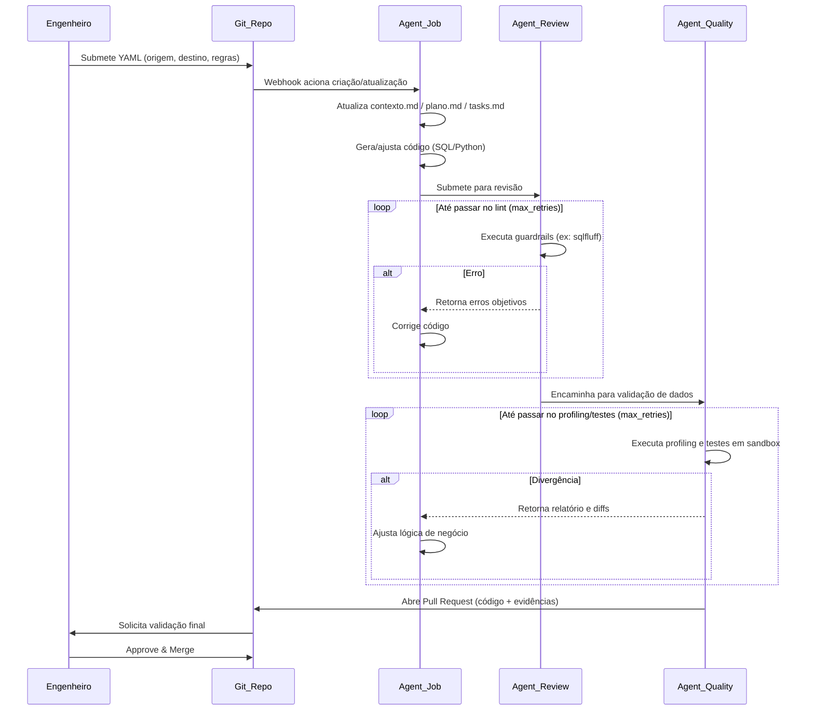
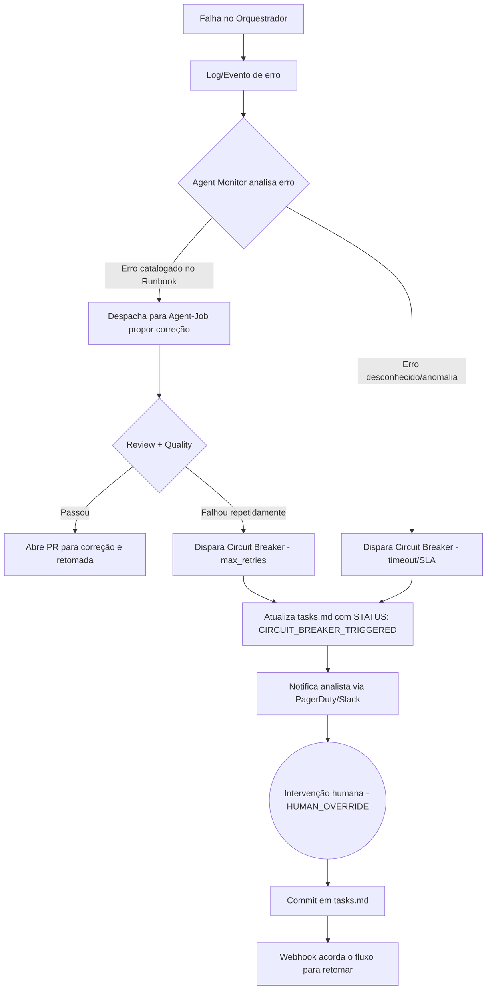

# Framework de Engenharia de Dados Orientada a Agentes (ADE)
## Documento de Arquitetura e "Constituição" do Sistema

> **Propósito**: definir diretrizes, arquitetura e padrões operacionais de um **Multi‑Agent System (MAS)** aplicado à Engenharia de Dados, com **geração/recuperação assistida por LLMs** e **execução determinística** ancorada em orquestradores tradicionais e guardrails.

---

## Sumário
1. [Visão Geral](#1-visão-geral)
2. [Escopo e Não‑Escopo](#2-escopo-e-não-escopo)
3. [Glossário e Conceitos‑Chave](#3-glossário-e-conceitos-chave-rastreabilidade-de-mercado)
4. [Topologia do Sistema](#4-topologia-do-sistema)
5. [Agentes e Responsabilidades](#5-agentes-e-responsabilidades)
6. [Fluxos de Operação (Diagramas)](#6-fluxos-de-operação-diagramas)
7. [Constituição do Sistema (Prompts, Estado e Regras)](#7-a-constituição-do-sistema-prompts-estado-e-regras)
8. [Guardrails, Segurança e Governança](#8-guardrails-segurança-e-governança)
9. [Observabilidade e SLOs](#9-observabilidade-e-slos)
10. [Pontos de Atenção e Considerações de Implementação](#10-pontos-de-atenção-e-considerações-de-implementação)

---

## 1. Visão Geral
Este framework realiza a transição de pipelines puramente imperativos para **pipelines declarativos e orientados a intenção**. A IA atua como força de trabalho para:

- **Criar** e **evoluir** pipelines (código SQL/Python e configuração),
- **Revisar** (lint, performance estática, padrões),
- **Validar qualidade e fidelidade dos dados** (profiling/testes),
- **Apoiar self-healing** (propor correções com base em logs e runbooks),

enquanto a **execução rotineira** permanece sob um **orquestrador determinístico** (Airflow/Dagster etc.) e sob **Guardiões Determinísticos** (linters, testes, políticas de CI/CD).

---

## 2. Escopo e Não‑Escopo
### Escopo
- Criação/refatoração de pipelines a partir de especificações declarativas (ex.: YAML).
- Revisão automática de código via ferramentas determinísticas.
- Validação em sandbox e abertura de PR com evidências (ex.: relatórios).
- Self-healing baseado em catálogo de erros (runbook) + limites (circuit breaker).

### Não‑Escopo (por padrão)
- Execução "autônoma" em produção sem PR/approval humano (a menos que explicitamente habilitado).
- Acesso direto de agentes a segredos de produção fora do padrão do orquestrador/CI.
- Mudanças em dados de produção sem trilha auditável (PR + logs + artefatos).

---

## 3. Glossário e Conceitos‑Chave (Rastreabilidade de Mercado)
Para alinhamento com iniciativas de mercado e literatura de LLM Ops:

- **ADE (Agentic Data Engineering)**: paradigma em que agentes autônomos gerenciam o ciclo de vida de dados (ingestão, transformação, modelagem) guiados por **metadados** e **intenções declarativas** (ex.: YAML), em vez de scripts manuais.
- **MAS (Multi‑Agent System)**: múltiplos agentes interagindo sob o princípio de **Segregation of Duties** (criação ≠ revisão ≠ qualidade).
- **Tiered LLM Architecture (Arquitetura em camadas)**: uso de **modelos de fronteira** para raciocínio/geração (ex.: GPT‑4‑class, Claude‑class) e **SLMs locais** (ex.: Llama‑class via Ollama) para roteamento/triagem e monitoramento.
- **Deterministic Guardrails (Guardiões Determinísticos)**: ferramentas objetivas (ex.: `sqlfluff`, testes de qualidade, validadores de schema, profilers) que atuam como **juízes finais** do output. A IA itera até satisfazer essas ferramentas.
- **Documentation‑as‑Code (DaC) para Estado**: agentes são stateless; o estado operacional fica em arquivos versionados (Markdown/YAML) para auditabilidade.
- **Circuit Breaker**: mecanismo de confiabilidade para interromper loops (limite de iterações, orçamento de tempo, custo/tokens).
- **Context Window Management**: estratégia para garantir que o contexto carregado pelos agentes caiba na janela de contexto do LLM, incluindo técnicas de sumarização e priorização de informações.
- **Prompt Versioning**: versionamento dos system prompts dos agentes como artefatos de código, permitindo rastreabilidade e rollback.

---

## 4. Topologia do Sistema
A arquitetura integra componentes clássicos de engenharia de dados com o ecossistema de agentes.

### 4.1. Camada de Integração e Execução
- **Fontes de Dados (N)**: APIs, bancos relacionais, IoT, mensageria, arquivos, etc.
- **Data Lake / Data Warehouse**: destino final de armazenamento/compute.
- **Orquestrador ("Motor")**: Airflow/Dagster (ou equivalente).  
  - Executa DAGs/tarefas determinísticas.
  - Emite logs e eventos (webhooks) para monitoramento.
  - **Não toma decisões de design**; apenas executa e reporta.
- **CI/CD**: pipeline de validação (lint, testes, profiling, policy checks).
- **Repositório Git ("Memória de Longo Prazo")**:
  - Especificações (`.yaml`)
  - Regras/Config de guardrails
  - Estado do agente (`contexto.md`, `plano.md`, `tasks.md`)
  - Artefatos finais (SQL/Python)
  - Evidências (ex.: `Profiling_Report.md`)
  - System prompts versionados dos agentes

### 4.2. Camada de Resiliência de LLMs
- **Fallback entre provedores**: estratégia para alternar entre provedores de LLM (ex.: OpenAI → Anthropic → Local) em caso de indisponibilidade ou throttling.
- **Rate Limiting**: controle de taxa de requisições para evitar throttling e gerenciar custos.
- **Cache de respostas**: para operações repetitivas ou determinísticas, reduzindo latência e custo.

> **Ponto de Atenção**: Definir na implementação a estratégia de fallback, timeouts e política de retry para chamadas aos LLMs.

---

## 5. Agentes e Responsabilidades
> Regra: **um agente propõe, outro valida**. O agente de criação não "julga" seu próprio trabalho.

| Agente | Papel | Modelo sugerido | Entradas | Saídas |
|---|---|---|---|---|
| **Agent Monitor** | Roteamento/triagem; classifica falhas; aciona fluxos | SLM local | logs, eventos, runbook | tarefa para Agent‑Job; atualização de `tasks.md` |
| **Agent‑Job** | Constrói/ajusta pipeline | Frontier model | YAML, schemas, contexto atual | código SQL/Python; atualização de `contexto.md`, `plano.md`, `tasks.md` |
| **Agent‑Review** | Revisor determinístico de sintaxe/padrões/perf estática | Pode ser LLM + ferramentas | PR branch; regras de lint | feedback objetivo (erros); aprovação p/ qualidade |
| **Agent‑Quality** | Valida fidelidade/qualidade em sandbox | LLM + ferramentas de dados | datasets sandbox; regras DQ | relatório; aprovação/reprovação; gatilhos de retry |

Observação: "Agent‑Review" e "Agent‑Quality" devem tratar **ferramentas determinísticas** como fonte primária de verdade; LLM serve para interpretar mensagens e propor correções.

### 5.1. Comunicação entre Agentes
Os agentes se comunicam de forma **assíncrona** através de:
- **Arquivos de estado** no repositório Git (source of truth)
- **Webhooks/eventos** para acionamento de fluxos
- **Filas de mensagens** (opcional) para cenários de alta concorrência

> **Ponto de Atenção**: Definir protocolo de comunicação, formato de mensagens e tratamento de conflitos de escrita nos arquivos de estado.

### 5.2. Testabilidade dos Agentes
Os agentes devem ser projetados para testabilidade:
- **Testes unitários** dos prompts com inputs/outputs esperados
- **Testes de integração** do fluxo completo em ambiente isolado
- **Testes de regressão** para garantir que mudanças em prompts não quebrem comportamentos existentes

> **Ponto de Atenção**: Definir estratégia de testes e cobertura mínima para os agentes antes de produção.

---

## 6. Fluxos de Operação (Diagramas)

### 6.1. Fluxo de Desenvolvimento e Deploy (CI/CD guiado por IA)
Este fluxo ocorre na criação de um pipeline novo ou refatoração de um existente.

> **Pontos de Atenção para este fluxo**:
> - Definir **SLAs de tempo** para cada etapa (ex.: "geração inicial < 5 min")
> - Estabelecer **limite máximo de retries** por etapa antes de circuit breaker
> - Considerar **fast path** para mudanças triviais (ex.: apenas configuração, sem lógica)
> - Implementar **correlation ID** para rastreamento end-to-end

### 6.2. Fluxo de Resiliência (Self‑Healing + Circuit Breaker)
Ativado quando o orquestrador falha em produção.

> **Pontos de Atenção para este fluxo**:
> - O **Runbook** é crítico: definir processo de curadoria e atualização contínua
> - Considerar mecanismo de **sugestão automática** de novas entradas no runbook baseado em erros recorrentes
> - Definir **níveis de severidade** para determinar urgência da notificação
> - Estabelecer **tempo máximo** entre falha e abertura de PR de correção

### 6.3. Fluxo de Rollback (a ser detalhado)
Ativado quando um pipeline aprovado via PR causa problemas em produção.

> **Ponto de Atenção**: Este fluxo precisa ser especificado. Considerar:
> - Integração com feature flags para rollback instantâneo
> - Versionamento de pipelines para rollback a versões anteriores
> - Critérios automáticos para acionar rollback (ex.: taxa de erro > X%)
> - Notificação e registro de rollbacks para análise posterior

---

## 7. A Constituição do Sistema (Prompts, Estado e Regras)
Todos os agentes de criação (Job/Review/Quality) operam sob um system prompt base que impõe:

### 7.1. Princípio: "Padrão Amnésia"
- Agentes **não possuem memória de longo prazo**.
- Todo o estado/progresso/contexto deve residir na branch atual em:
  - `contexto.md` — interpretação do problema e metadados lidos
  - `plano.md` — estratégia passo a passo (Plan‑and‑Solve)
  - `tasks.md` — checklist operacional e estado

> **Ponto de Atenção**: Definir **limites de tamanho** para cada arquivo de estado para garantir que caibam na context window do LLM. Estabelecer estratégia de **sumarização** quando limites forem atingidos.

### 7.2. Subserviência aos Guardiões
- O agente **não contesta** `sqlfluff`, testes de dados, validações de schema, políticas de CI.
- Se falhar, **corrige e reexecuta** até:
  - passar, ou
  - acionar circuit breaker.

### 7.3. Sintaxe de Gerenciamento de Estado (obrigatória em `tasks.md`)
Os agentes devem utilizar e respeitar:

- `[STATUS: PENDING | RUNNING | DONE]` — progresso de cada tarefa
- `[STATUS: CIRCUIT_BREAKER_TRIGGERED]` — limite atingido; agente deve **parar imediatamente**
- `[HUMAN_OVERRIDE: INITIATED] ... [HUMAN_OVERRIDE: END]` — bloco exclusivo humano

### 7.4. Regra Suprema de Retomada
Se ao inicializar o agente encontrar `[HUMAN_OVERRIDE: INITIATED]` em `tasks.md`, deve:
1. Interromper qualquer raciocínio prévio sobre a tarefa.
2. Assumir instruções do bloco como diretrizes absolutas.
3. Retomar execução exatamente do ponto indicado pelo humano.

### 7.5. Versionamento de Prompts
Os system prompts dos agentes são artefatos de código e devem ser:
- Versionados no repositório Git junto com o código
- Testados antes de deploy (testes de regressão)
- Rastreáveis (qual versão do prompt gerou qual output)

> **Ponto de Atenção**: Definir estrutura de diretórios e convenção de nomeação para prompts. Estabelecer processo de review para mudanças em prompts.

---

## 8. Guardrails, Segurança e Governança
Mínimos recomendados:
- **Branch protection**: exigir CI verde e aprovação humana para merge.
- **Permissões**: agentes criam branches/PRs, mas não fazem merge em `main` sem policy.
- **Segredos**: acesso via secret manager do CI/orquestrador; nunca armazenar segredos em Markdown/YAML.
- **Sandbox obrigatório**: Agent‑Quality valida em ambiente isolado com dados mascarados quando aplicável.
- **Trilha de auditoria**: PR + artifacts + logs centralizados.
- **Isolamento de ambientes**: garantir separação entre sandbox, staging e produção.

### 8.1. Controle de Custos
- **Budget por execução**: limite máximo de tokens/custo por pipeline
- **Alertas de consumo**: notificação quando consumo exceder thresholds
- **Relatórios periódicos**: visibilidade de custos por agente, por pipeline, por time

> **Ponto de Atenção**: Definir quotas e limites de custo antes de habilitar execução em escala.

### 8.2. Multi-tenancy (se aplicável)
Se a arquitetura for compartilhada entre múltiplos times/projetos:
- **Isolamento de dados**: cada tenant acessa apenas seus dados
- **Isolamento de recursos**: quotas de compute/tokens por tenant
- **Isolamento de configuração**: prompts e guardrails podem ser customizados por tenant

> **Ponto de Atenção**: Avaliar necessidade de multi-tenancy e definir modelo de isolamento adequado.

---

## 9. Observabilidade e SLOs
Registrar e monitorar:
- contagem de retries por etapa (review/quality),
- tempo total até PR (latência),
- taxa de falhas por categoria de runbook,
- custos (tokens, tempo de execução, recursos),
- SLAs de self-healing (tempo até abrir PR / tempo até intervenção humana).

### 9.1. Métricas Recomendadas

| Categoria | Métrica | Objetivo |
|-----------|---------|----------|
| **Latência** | Tempo médio até PR aberto | Medir eficiência do fluxo |
| **Qualidade** | Taxa de aprovação na 1ª tentativa | Medir qualidade do output dos agentes |
| **Resiliência** | MTTR (Mean Time to Recovery) | Medir eficácia do self-healing |
| **Custo** | Tokens consumidos por pipeline | Controlar gastos |
| **Disponibilidade** | Uptime dos agentes | Garantir disponibilidade do sistema |

### 9.2. Rastreabilidade
- **Correlation ID**: identificador único propagado em todo o fluxo
- **Logs estruturados**: formato consistente para análise automatizada
- **Linking**: conexão entre logs, arquivos de estado, PRs e execuções do orquestrador

> **Ponto de Atenção**: Definir padrão de logging e implementar correlation ID antes de produção.

---

## 10. Pontos de Atenção e Considerações de Implementação

Esta seção consolida os pontos que devem ser endereçados durante a implementação da arquitetura.

### 10.1. Fase de Design Detalhado

| # | Área | Ponto de Atenção | Prioridade |
|---|------|------------------|------------|
| 1 | LLMs | Estratégia de fallback entre provedores | Alta |
| 2 | LLMs | Gestão de context window e sumarização | Alta |
| 3 | LLMs | Rate limiting e controle de custos | Alta |
| 4 | Estado | Limites de tamanho para arquivos `.md` | Média |
| 5 | Estado | Tratamento de conflitos de escrita | Média |
| 6 | Comunicação | Protocolo entre agentes | Alta |
| 7 | Prompts | Estrutura de versionamento | Média |
| 8 | Testes | Estratégia de testes para agentes | Alta |

### 10.2. Fase de Implementação

| # | Área | Ponto de Atenção | Prioridade |
|---|------|------------------|------------|
| 9 | Fluxos | SLAs de tempo por etapa | Alta |
| 10 | Fluxos | Fast path para mudanças triviais | Média |
| 11 | Fluxos | Fluxo de rollback | Alta |
| 12 | Runbook | Processo de curadoria e atualização | Alta |
| 13 | Runbook | Sugestão automática de novas entradas | Baixa |
| 14 | Observabilidade | Implementação de correlation ID | Alta |
| 15 | Observabilidade | Dashboard unificado | Média |

### 10.3. Fase de Operação

| # | Área | Ponto de Atenção | Prioridade |
|---|------|------------------|------------|
| 16 | Custos | Definição de quotas e budgets | Alta |
| 17 | Custos | Alertas de consumo anômalo | Média |
| 18 | Governança | Processo de review para mudanças em prompts | Alta |
| 19 | Governança | Multi-tenancy (se aplicável) | Variável |
| 20 | Qualidade | Métricas de qualidade do código gerado | Média |

### 10.4. Riscos Arquiteturais

| Risco | Impacto | Mitigação |
|-------|---------|-----------|
| **Complexidade operacional** | Alto — muitos componentes interagindo | Health checks, dashboards unificados, runbooks detalhados |
| **Latência do fluxo completo** | Médio — loops de retry podem ser longos | Fast path, limites de retry, SLAs por etapa |
| **Dependência de LLMs externos** | Alto — indisponibilidade bloqueia fluxos | Fallback entre provedores, cache, graceful degradation |
| **Runbook incompleto** | Médio — alta taxa de circuit breaker inicial | Processo de curadoria, sugestão automática |
| **Custos descontrolados** | Alto — uso de LLMs pode escalar rapidamente | Quotas, alertas, relatórios de consumo |
| **Debugging distribuído** | Médio — difícil rastrear problemas | Correlation ID, logs estruturados, estado em arquivos |

---

## Histórico de Revisões

| Data | Versão | Descrição |
|------|--------|-----------|
| 2026-04-01 | 1.1 | Adicionados pontos de atenção, considerações de implementação e seções sobre resiliência de LLMs, testabilidade, rollback, controle de custos e multi-tenancy |
| — | 1.0 | Versão inicial do documento |