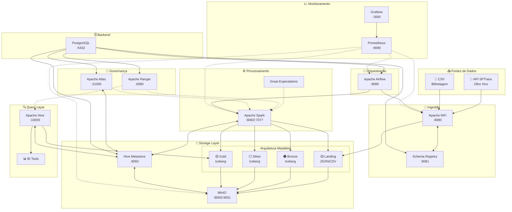

# Open Data Platform - Plano de Implementação

## Objetivo

Construir um Lakehouse funcional camada a camada, utilizando componentes open source do ecossistema Cloudera Data Platform (CDP), com um case de processamento de dados de transporte público (SPTrans - API Olho Vivo).

---

## Diagrama da Arquitetura

---

## Arquitetura

### Stack Tecnológico

| Componente | Função | Equivalente CDP |
|------------|--------|-----------------|
| MinIO | Object Store S3-compatible | Ozone |
| Hive Metastore | Catálogo de tabelas Iceberg | HMS |
| Apache NiFi | Ingestão e roteamento | Cloudera DataFlow |
| Schema Registry | Contratos de dados | Cloudera Schema Registry |
| Apache Spark | Processamento distribuído | Cloudera Data Engineering |
| Apache Iceberg | Formato de tabela open | Iceberg CDP |
| Apache Ranger | Políticas de segurança | Ranger CDP |
| Apache Atlas | Governança e linhagem | Atlas CDP |
| Apache Airflow | Orquestração de pipelines | Airflow CDE |
| Apache Hive | Query engine SQL | Hive/Impala CDW |

### Arquitetura Medallion

| Camada | Bucket | Formato | Descrição |
|--------|--------|---------|-----------|
| Landing | `s3://landing/` | JSON/CSV | Dados brutos exatamente como recebidos |
| Bronze | `s3://bronze/` | Iceberg | Dados convertidos, particionados, sem transformação |
| Silver | `s3://silver/` | Iceberg | Dados limpos, validados, enriquecidos |
| Gold | `s3://gold/` | Iceberg | Agregados prontos para consumo |

### Fluxo de Dados

1. **Ingestão** - NiFi autentica na API SPTrans, valida payload contra Schema Registry, grava em Landing
2. **Bronze** - Spark converte JSON/CSV para Iceberg, adiciona metadados de ingestão
3. **Silver** - Spark aplica Great Expectations, realiza joins e enriquecimento
4. **Gold** - Spark gera agregados de performance, demanda e bilhetagem
5. **Consulta** - Hive expõe camada Gold via SQL para BI
6. **Governança** - Ranger aplica mascaramento e RBAC, Atlas rastreia linhagem

---

## Estratégia de Implantação

> **Abordagem Incremental:** Cada serviço será implantado manualmente via `docker run`, validado individualmente e integrado aos demais antes de avançar. Após compreensão completa do funcionamento, será consolidado em `docker-compose.yml` final.

| Ordem | Serviço | Dependência |
|-------|---------|-------------|
| 1 | MinIO | Nenhuma |
| 2 | PostgreSQL | Nenhuma |
| 3 | Hive Metastore | PostgreSQL, MinIO |
| 4 | Schema Registry | PostgreSQL |
| 5 | NiFi | Schema Registry, MinIO |
| 6 | Spark | Hive Metastore, MinIO |
| 7 | Great Expectations | Spark |
| 8 | Hive (Query Engine) | Hive Metastore, MinIO |
| 9 | Ranger | PostgreSQL |
| 10 | Atlas | PostgreSQL, Hive Metastore |
| 11 | Airflow | PostgreSQL, todos os anteriores |
| 12 | Prometheus + Grafana | Todos os serviços |
| 13 | Docker Compose | Consolidação final |

---

## Steps

### Step 1: MinIO (Object Store)

Implantar object store S3-compatible como fundação do data lake.

| Aspecto | Detalhe |
|---------|---------|
| Imagem | minio/minio |
| Portas | 9000 (S3 API), 9001 (Console) |
| Volumes | Diretório local para persistência |
| Dependência | Nenhuma |

**Buckets a criar:**

| Bucket | Propósito |
|--------|-----------|
| landing | Dados brutos (JSON/CSV) |
| bronze | Tabelas Iceberg sem transformação |
| silver | Tabelas Iceberg limpas e enriquecidas |
| gold | Tabelas Iceberg agregadas |

**Validação:**
- Acessar console em http://localhost:9001
- Criar buckets: landing, bronze, silver, gold
- Testar upload/download via console ou CLI (mc)

---

### Step 2: PostgreSQL (Backend de Metadados)

Implantar banco de dados para Hive Metastore, Schema Registry e Airflow.

| Aspecto | Detalhe |
|---------|---------|
| Imagem | postgres:15 |
| Porta | 5432 |
| Volumes | Diretório local para persistência |
| Dependência | Nenhuma |

**Databases a criar:**

| Database | Propósito |
|----------|-----------|
| metastore | Backend Hive Metastore |
| schemaregistry | Backend Schema Registry |
| airflow | Backend Airflow |
| ranger | Backend Ranger |
| atlas | Backend Atlas |

**Validação:**
- Conectar via psql ou cliente SQL
- Criar databases listados
- Verificar permissões de usuário

---

### Step 3: Hive Metastore (Catálogo Iceberg)

Implantar catálogo de tabelas integrado ao MinIO.

| Aspecto | Detalhe |
|---------|---------|
| Imagem | apache/hive |
| Porta | 9083 (Thrift) |
| Dependência | PostgreSQL, MinIO |

**Configuração:**
- Backend PostgreSQL para metadados
- Endpoint S3 apontando para MinIO
- Warehouse em s3a://bronze/

**Validação:**
- Verificar conexão com PostgreSQL
- Testar criação de database via beeline
- Verificar comunicação com MinIO

---

### Step 4: Schema Registry (Contratos de Dados)

Implantar registro de schemas para validação de payloads.

| Aspecto | Detalhe |
|---------|---------|
| Imagem | confluentinc/cp-schema-registry |
| Porta | 8081 |
| Dependência | PostgreSQL |

**Schemas a registrar:**

| Schema | Versão | Descrição |
|--------|--------|-----------|
| sptrans.bus_position | v1 | Posição em tempo real dos ônibus |
| sptrans.bus_line | v1 | Informações das linhas |
| sptrans.bus_stop | v1 | Informações das paradas |
| billing.transaction | v1 | Eventos de bilhetagem simulados |

**Política de evolução:** BACKWARD (compatibilidade com consumidores existentes)

**Validação:**
- Acessar API em http://localhost:8081
- Registrar schema de teste via curl
- Consultar schemas registrados

---

### Step 5: Apache NiFi (Ingestão)

Implantar ferramenta de ingestão e roteamento de dados.

| Aspecto | Detalhe |
|---------|---------|
| Imagem | apache/nifi |
| Porta | 8080 (UI) |
| Dependência | Schema Registry, MinIO |

**Flows a criar:**

| Flow | Fonte | Destino | Validação |
|------|-------|---------|-----------|
| SPTrans Posição | API /Posicao | landing/sptrans/position/ | sptrans.bus_position.v1 |
| SPTrans Linhas | API /Linha/Buscar | landing/sptrans/lines/ | sptrans.bus_line.v1 |
| SPTrans Paradas | API /Parada/Buscar | landing/sptrans/stops/ | sptrans.bus_stop.v1 |
| Bilhetagem CSV | Arquivo local | landing/billing/ | billing.transaction.v1 |

**Validação:**
- Acessar UI em http://localhost:8080
- Configurar conexão com MinIO (S3)
- Testar ingestão de arquivo para landing/

---

### Step 6: Apache Spark (Processamento)

Implantar cluster Spark para transformações de dados.

| Aspecto | Detalhe |
|---------|---------|
| Imagem | bitnami/spark |
| Portas | 8082 (Master UI), 7077 (Master), 8083 (Worker) |
| Dependência | Hive Metastore, MinIO |

**Configuração:**
- JARs: iceberg-spark, hadoop-aws, aws-java-sdk
- Endpoint S3 apontando para MinIO
- Catálogo Hive via Thrift

**Jobs a desenvolver:**

| Job | Origem | Destino | Função |
|-----|--------|---------|--------|
| landing_to_bronze | landing/* | bronze/* | Conversão Iceberg + metadados (_ingested_at, _source_file) |
| bronze_to_silver | bronze/* | silver/* | Validação + joins + limpeza |
| silver_to_gold | silver/* | gold/* | Agregados de performance, demanda e bilhetagem |

**Validação:**
- Acessar UI em http://localhost:8082
- Executar spark-shell conectado ao Hive Metastore
- Testar leitura/escrita de arquivo do MinIO

---

### Step 7: Great Expectations (Qualidade de Dados)

Configurar validações de qualidade para pipeline Bronze → Silver.

| Aspecto | Detalhe |
|---------|---------|
| Instalação | pip install great-expectations |
| Integração | Spark jobs |
| Dependência | Spark |

**Expectativas a definir:**

| Tipo | Validação |
|------|-----------|
| Completude | Campos obrigatórios não nulos |
| Formato | Datas, coordenadas, IDs válidos |
| Range | Latitude (-90 a 90), Longitude (-180 a 180) |
| Unicidade | IDs de linha e parada únicos |

**Validação:**
- Executar suite de expectativas via Spark
- Gerar relatório HTML
- Verificar dados rejeitados em quarentena

---

### Step 8: Apache Hive (Query Layer)

Implantar engine SQL para acesso à camada Gold.

| Aspecto | Detalhe |
|---------|---------|
| Imagem | apache/hive |
| Porta | 10000 (HiveServer2 JDBC), 10002 (Web UI) |
| Dependência | Hive Metastore, MinIO |

**Funcionalidades:**

| Recurso | Descrição |
|---------|-----------|
| Endpoint JDBC | Conexão para ferramentas BI via HiveServer2 |
| Predicate Pushdown | Otimização de queries Iceberg |
| Integração Ranger | Políticas de segurança nativas |
| Time Travel | Consultas históricas via Iceberg |

**Validação:**
- Acessar Web UI em http://localhost:10002
- Conectar via beeline (CLI)
- Executar query em tabela Gold

---

### Step 9: Apache Ranger (Segurança)

Implantar serviço de políticas de acesso e mascaramento.

| Aspecto | Detalhe |
|---------|---------|
| Imagem | apache/ranger |
| Porta | 6080 (Admin UI) |
| Dependência | PostgreSQL |

**Políticas a criar:**

| Política | Escopo | Regra |
|----------|--------|-------|
| Mascaramento PII | Campo card_id | Hash para não-admin |
| Acesso por Camada | Buckets | Analistas apenas Gold |
| RBAC | Roles | admin, analyst, developer |

**Validação:**
- Acessar Admin UI em http://localhost:6080
- Criar política de teste
- Verificar auditoria de acessos

---

### Step 10: Apache Atlas (Governança)

Implantar serviço de linhagem e classificação de dados.

| Aspecto | Detalhe |
|---------|---------|
| Imagem | apache/atlas |
| Porta | 21000 (UI) |
| Dependência | PostgreSQL, Hive Metastore |

**Funcionalidades:**

| Recurso | Descrição |
|---------|-----------|
| Linhagem | API SPTrans → NiFi → Landing → Spark → Bronze → Silver → Gold |
| Classificação PII | Identificação automática de dados sensíveis |
| Glossário | Termos de negócio do domínio de transporte |
| Busca | Interface web para navegação de metadados |

**Validação:**
- Acessar UI em http://localhost:21000
- Verificar integração com Hive Metastore
- Visualizar linhagem de tabela

---

### Step 11: Apache Airflow (Orquestração)

Implantar orquestrador de pipelines.

| Aspecto | Detalhe |
|---------|---------|
| Imagem | apache/airflow |
| Porta | 8085 (UI) |
| Dependência | PostgreSQL, todos os serviços anteriores |

**DAG Principal (mobility_analytics_daily):**

| Ordem | Tarefa | Dependência |
|-------|--------|-------------|
| 1 | Trigger NiFi | - |
| 2 | Sensor Landing Zone | 1 |
| 3 | Spark Landing → Bronze | 2 |
| 4 | Spark Bronze → Silver | 3 |
| 5 | Spark Silver → Gold | 4 |
| 6 | Notificação | 5 |

**Configurações:**
- Retry com backoff exponencial
- SLA monitoring
- Alertas de falha

**Validação:**
- Acessar UI em http://localhost:8085
- Ativar DAG de teste
- Verificar execução de tarefas

---

### Step 12: Prometheus + Grafana (Monitoramento)

Implantar stack de monitoramento para métricas e dashboards.

| Aspecto | Detalhe |
|---------|---------|
| Imagem Prometheus | prom/prometheus |
| Porta Prometheus | 9090 |
| Imagem Grafana | grafana/grafana |
| Porta Grafana | 3000 |
| Dependência | Todos os serviços (coleta métricas) |

**Métricas a coletar:**

| Serviço | Métricas |
|---------|----------|
| MinIO | Requests, latência, espaço |
| Spark | Jobs, duração, sucesso/falha |
| NiFi | FlowFiles, backpressure, throughput |
| Hive | Queries ativas, tempo de resposta |
| Airflow | DAGs, tasks, SLA violations |

**Dashboards iniciais:**
- Saúde dos serviços (UP/DOWN)
- Pipeline de dados (registros por camada)
- Jobs Spark (duração, status)
- Alertas ativos

**Validação:**
- Acessar Prometheus em http://localhost:9090
- Acessar Grafana em http://localhost:3000
- Verificar targets ativos no Prometheus
- Visualizar dashboard de saúde

---

### Step 13: Consolidação Docker Compose

Após validação individual de todos os serviços, consolidar em docker-compose.yml.

| Aspecto | Detalhe |
|---------|---------|
| Arquivo | docker-compose.yml |
| Rede | dataplatform-network |
| Volumes | Mapeados para persistência |

**Entregáveis:**
- docker-compose.yml com todos os serviços
- Variáveis de ambiente em .env
- Scripts de inicialização
- Documentação de uso

**Validação:**
- Destruir todos os containers individuais
- Executar `docker-compose up -d`
- Verificar healthchecks de todos os serviços
- Testar pipeline fim-a-fim

---

## Artefatos

### Arquivos a Criar

| Artefato | Propósito | Execução |
|----------|-----------|----------|
| docker-compose.yml | Orquestração de containers (consolidação final) | Manual (Step 13) |
| init-buckets.sh | Criação de buckets MinIO | Manual (Step 1) |
| prometheus.yml | Configuração de targets Prometheus | Manual (Step 12) |
| grafana-dashboards/*.json | Dashboards de monitoramento | Manual (Step 12) |
| schemas/*.avsc | Schemas Avro para Schema Registry | Manual (Step 4) |
| nifi-flows/*.xml | Templates de flows NiFi | Manual (Step 5) |
| spark-jobs/*.py | Jobs Spark (Landing→Bronze→Silver→Gold) | Manual (Step 6) |
| great-expectations/*.json | Suites de expectativas | Manual (Step 7) |
| ranger-policies/*.json | Políticas de segurança | Manual (Step 9) |
| airflow-dags/*.py | DAGs de orquestração | Manual (Step 11) |

### Dados de Exemplo

| Arquivo | Descrição |
|---------|-----------|
| sample-billing.csv | Transações fictícias de bilhetagem |
| sample-positions.json | Posições de ônibus para teste |

---

## Fontes de Dados

### API Olho Vivo - SPTrans

| Endpoint | Método | Descrição |
|----------|--------|-----------|
| /Login/Autenticar | POST | Obtenção de token |
| /Posicao | GET | Posição dos veículos |
| /Linha/Buscar | GET | Busca de linhas |
| /Parada/Buscar | GET | Busca de paradas |

**Documentação:** https://www.sptrans.com.br/desenvolvedores/

### Bilhetagem Simulada

| Campo | Tipo | Descrição |
|-------|------|-----------|
| card_id | string | ID do cartão (PII) |
| line_id | string | ID da linha |
| timestamp | datetime | Data/hora da transação |
| stop_id | string | ID da parada |
| fare_type | string | Tipo de tarifa |

---

## Execução

### Setup Incremental (Step by Step)

Cada serviço é implantado e validado individualmente:

1. Executar `docker run` do serviço conforme Step
2. Validar funcionamento isolado
3. Configurar integração com serviços anteriores
4. Validar comunicação entre serviços
5. Avançar para próximo Step

### Consolidação Final (Step 13)

1. Destruir todos os containers individuais
2. Criar docker-compose.yml consolidado
3. Executar `docker-compose up -d`
4. Validar pipeline fim-a-fim

### Execução Recorrente (pós-consolidação)

1. DAG `mobility_analytics_daily` executa automaticamente via Airflow
2. Monitorar execução via interface Airflow
3. Monitorar métricas via Grafana
4. Consultar dados agregados via Hive

---

## Validação

### Critérios de Aceite por Step

| Step | Serviço | Critério |
|------|---------|----------|
| 1 | MinIO | Console acessível, buckets criados |
| 2 | PostgreSQL | Conexão funcional, databases criados |
| 3 | Hive Metastore | Conexão com PostgreSQL e MinIO, database criado |
| 4 | Schema Registry | API acessível, schema registrado |
| 5 | NiFi | UI acessível, dados chegando em landing/ |
| 6 | Spark | UI acessível, leitura/escrita no MinIO |
| 7 | Great Expectations | Relatório HTML gerado |
| 8 | Hive | Queries SQL retornando dados |
| 9 | Ranger | Mascaramento funcionando para não-admin |
| 10 | Atlas | Linhagem visualizável |
| 11 | Airflow | DAG executando tarefas |
| 12 | Prometheus + Grafana | Métricas coletadas, dashboards funcionais |
| 13 | Docker Compose | Todos os serviços healthy, pipeline fim-a-fim |

---

## Rollback

### Por Step Individual

- Parar container: `docker stop <container_name>`
- Remover container: `docker rm <container_name>`
- Remover volume se necessário: `docker volume rm <volume_name>`
- Reiniciar Step específico

### Rollback Total

1. Parar todos os containers
2. Remover volumes persistentes
3. Limpar imagens: `docker system prune`
4. Reiniciar do Step 1
