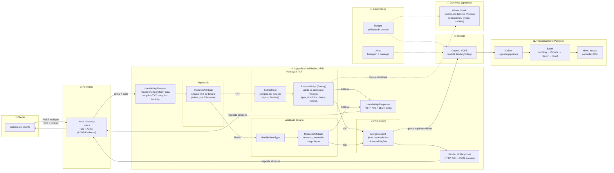
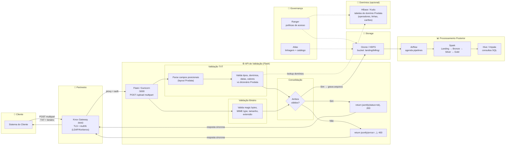

# NIFI

```mermaid
flowchart LR
    subgraph CLIENTE["👤 Cliente"]
        APP["Sistema do Cliente"]
    end

    subgraph PERIMETRO["🔐 Perímetro"]
        KNOX["Knox Gateway<br/>:8443<br/>TLS + AuthN (LDAP/Kerberos)"]
    end

    subgraph INGESTAO["⚙️ Ingestão & Validação (NiFi)"]
        direction TB
        HANDLE_REQ["HandleHttpRequest<br/>recebe multipart/form-data<br/>(arquivo TXT + arquivo binário)"]
        
        subgraph SPLIT["Separação"]
            ROUTE_TYPE["RouteOnAttribute<br/>separa TXT do binário<br/>(mime.type / filename)"]
        end

        subgraph VALID_TXT["Validação TXT"]
            EXTRACT["ExtractText<br/>campos por posição<br/>(layout Prodata)"]
            SCRIPT_TXT["ExecuteScript (Groovy)<br/>valida vs dicionário Prodata:<br/>tipos, domínios, datas, valores"]
        end

        subgraph VALID_BIN["Validação Binário"]
            MIME["IdentifyMimeType"]
            ROUTE_BIN["RouteOnAttribute<br/>tamanho, extensão,<br/>magic bytes"]
        end

        subgraph RESULTADO["Consolidação"]
            MERGE["MergeContent<br/>junta resultado das<br/>duas validações"]
        end

        HANDLE_RESP_OK["HandleHttpResponse<br/>HTTP 200 + JSON sucesso"]
        HANDLE_RESP_ERR["HandleHttpResponse<br/>HTTP 400 + JSON erros"]

        HANDLE_REQ --> ROUTE_TYPE
        ROUTE_TYPE -->|TXT| EXTRACT
        ROUTE_TYPE -->|Binário| MIME
        EXTRACT --> SCRIPT_TXT
        MIME --> ROUTE_BIN
        SCRIPT_TXT -->|OK| MERGE
        ROUTE_BIN -->|OK| MERGE
        SCRIPT_TXT -->|FALHA| HANDLE_RESP_ERR
        ROUTE_BIN -->|FALHA| HANDLE_RESP_ERR
        MERGE --> HANDLE_RESP_OK
    end

    subgraph STORAGE["💾 Storage"]
        OZONE["Ozone / HDFS<br/>bucket: landing/billing/"]
    end

    subgraph LOOKUP["📖 Domínios (opcional)"]
        HBASE["HBase / Kudu<br/>tabelas de domínio Prodata<br/>(operadores, linhas, cartões)"]
    end

    subgraph GOVERNANCA["🔐 Governança"]
        RANGER["Ranger<br/>políticas de acesso"]
        ATLAS["Atlas<br/>linhagem + catálogo"]
    end

    subgraph BATCH["📊 Processamento Posterior"]
        AIRFLOW["Airflow<br/>agenda pipelines"]
        SPARK["Spark<br/>Landing → Bronze → Silver → Gold"]
        HIVE["Hive / Impala<br/>consultas SQL"]
    end

    APP -->|"POST multipart<br/>TXT + binário"| KNOX
    KNOX -->|"proxy + auth"| HANDLE_REQ
    HANDLE_RESP_OK -->|resposta síncrona| KNOX
    HANDLE_RESP_ERR -->|resposta síncrona| KNOX
    KNOX --> APP

    MERGE -->|"grava arquivos válidos"| OZONE
    SCRIPT_TXT -.->|"lookup domínios"| HBASE

    RANGER -.-> OZONE
    RANGER -.-> HBASE
    ATLAS -.-> OZONE

    OZONE --> AIRFLOW
    AIRFLOW --> SPARK
    SPARK --> HIVE
```

# FLASK

```mermaid
flowchart LR
    subgraph CLIENTE["👤 Cliente"]
        APP_CLI["Sistema do Cliente"]
    end

    subgraph PERIMETRO["🔐 Perímetro"]
        KNOX["Knox Gateway<br/>:8443<br/>TLS + AuthN (LDAP/Kerberos)"]
    end

    subgraph API["⚙️ API de Validação (Flask)"]
        direction TB
        ENDPOINT["Flask / Gunicorn<br/>:5000<br/>POST /upload multipart"]

        subgraph VALID_TXT["Validação TXT"]
            PARSE["Parse campos posicionais<br/>(layout Prodata)"]
            RULES_TXT["Valida tipos, domínios,<br/>datas, valores<br/>vs dicionário Prodata"]
        end

        subgraph VALID_BIN["Validação Binário"]
            MAGIC["Valida magic bytes,<br/>MIME type, tamanho,<br/>extensão"]
        end

        subgraph RESULTADO["Consolidação"]
            DECIDE{"Ambos<br/>válidos?"}
        end

        RESP_OK["return jsonify(status=ok), 200"]
        RESP_ERR["return jsonify(erros=...), 400"]

        ENDPOINT --> PARSE
        ENDPOINT --> MAGIC
        PARSE --> RULES_TXT
        RULES_TXT --> DECIDE
        MAGIC --> DECIDE
        DECIDE -->|Sim| RESP_OK
        DECIDE -->|Não| RESP_ERR
    end

    subgraph STORAGE["💾 Storage"]
        OZONE["Ozone / HDFS<br/>bucket: landing/billing/"]
    end

    subgraph LOOKUP["📖 Domínios (opcional)"]
        HBASE["HBase / Kudu<br/>tabelas de domínio Prodata<br/>(operadores, linhas, cartões)"]
    end

    subgraph GOVERNANCA["🔐 Governança"]
        RANGER["Ranger<br/>políticas de acesso"]
        ATLAS["Atlas<br/>linhagem + catálogo"]
    end

    subgraph BATCH["📊 Processamento Posterior"]
        AIRFLOW["Airflow<br/>agenda pipelines"]
        SPARK["Spark<br/>Landing → Bronze → Silver → Gold"]
        HIVE["Hive / Impala<br/>consultas SQL"]
    end

    APP_CLI -->|"POST multipart<br/>TXT + binário"| KNOX
    KNOX -->|"proxy + auth"| ENDPOINT
    RESP_OK -->|resposta síncrona| KNOX
    RESP_ERR -->|resposta síncrona| KNOX
    KNOX --> APP_CLI

    DECIDE -->|"Sim → grava arquivos"| OZONE
    RULES_TXT -.->|"lookup domínios"| HBASE

    RANGER -.-> OZONE
    RANGER -.-> HBASE
    ATLAS -.-> OZONE

    OZONE --> AIRFLOW
    AIRFLOW --> SPARK
    SPARK --> HIVE
```